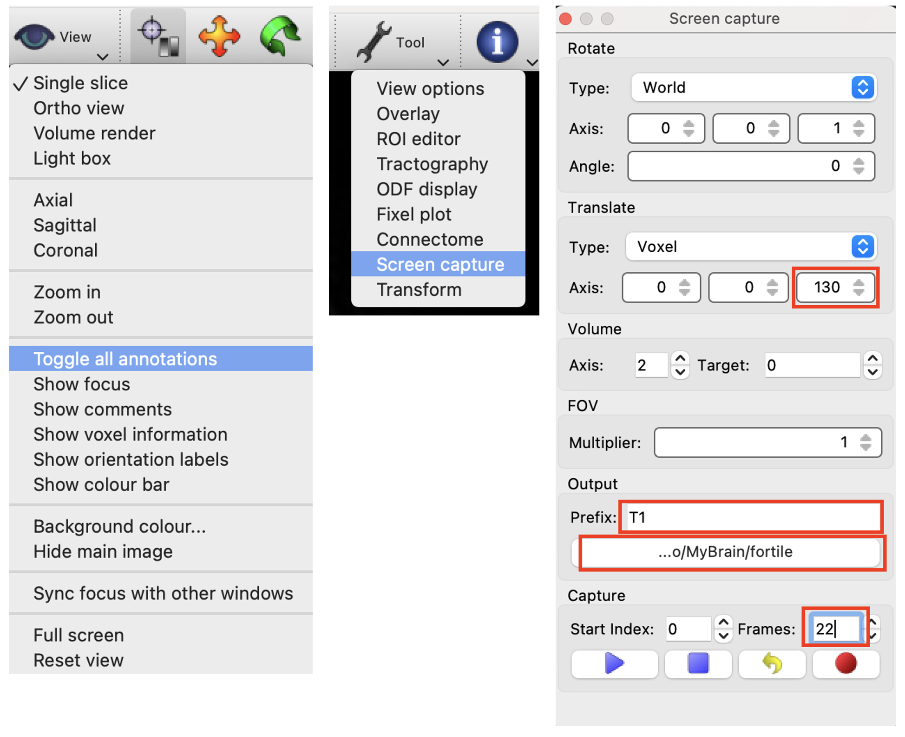

# tilemake

## Make a Powerpoint presentation with DICOM (or NIfTI) images

### you can create tiled images as shown in the figure from DICOM or NIfTI image.


Materials: DICOM files (or NIfTI files)

Tools: MRtrix3, FSL, tilemake.sh

* Click here for installation instructions (very famous and useful software for brain image analysis, but beware of its large size)

  * [MRtrix3](https://github.com/MRtrix3/homebrew-mrtrix3)
  * [FSL](https://fsl.fmrib.ox.ac.uk/fsl/fslwiki/FslInstallation)

### Preperation

#### Use mrview's screencapture to create  png files of the images you want to put on your slide.

1. for DICOM images, convert to NiFTI (use dcm2niix or similar)
1. open the file in mrview
1. view→Toggle all annotations to remove text and crosshair on the screen
1. adjust the image if necessary (intensity, orientation, etc.)
1. select Tools→Screen capture

1. To synchronize paging through the cross-sectional images (to make them look like a radiologist's viewer), set parameters as shown in the upper right figure.

    1. Scroll the image to the desired starting position.
    2. Set the box (Z-axis) at the right end of Translate to a value that matches the end position. If you are not sure, set the same value as in the figure and adjust it later.
    3. In Capture, set Start Index to 0 and Frames to the number of frames you want.
    4. Choose a name for the image in Output's Prefix (T2, DWI, etc., the simpler the better)
    5. Select the directory where you want to output the images.
    6. After setting, perform a test play using the triangle button in the lower left corner to adjust the settings.
    7. If settings ⅰ, ⅱ, and ⅲ are aligned with each other, the position can be synchronized regardless of the slice thickness.

1. Press record button (red circle) to save as png.
1. When the images you want to put on the slides are collected, the preparation is complete.

(If anyone knows how to automate this part of the process, please let me know.)

### Cooking

#### Run tilemake.sh to create tiled png files

First, clone this repository anywhere you like.
```
cd ~
git clone https://github.com/Kikubernetes/tilemake-en.git
```
Assuming that ~/imgdir is the directory where you saved the "pre-cooked" png files and this repository is in home directory,

```bash
mv ~/tilemake-en/tilemake.sh ~/imgdir　#move tilemake.sh to imgdir
cd ~/imgdir
chmod 755 tilemake.sh　#make executable
bash tilemake.sh　#run
```

- "How many png files per image?">: Specify the number of pngs per type of image you wish to arrange (in the above case, 22).
- "Enter the names of the images you want to arrange separated by spaces(eg. T1 T2 DWI...)"> 
  - Use the prefix of the image (that you used in ScreenCapture)
  - ex) In the case of the sample image: `T2 T1 fMRI b0 DWI FA`
  - Select 2-6 series
- After processing, tiled png files are output in the "tiles" folder.
  
### Finishing

#### Put the tiled images into PowerPoint

PowerPoint has a photo album feature to import multiple images (one image per slide) at a time, but the Mac version may not have it. In that case, it is easier to use LibreOffice. (You can download it from [here][1])
After installation, open a new presentation file and select Insert > Media > Photo Albums to insert multiple images (one image per slide) at a time. Then save the file in .pptx format, and you can copy and paste the entire slide into PowerPoint.
Click here for [LibreOffice Photo Album instruction][2].

[1]:https://www.libreoffice.org
[2]:https://help.libreoffice.org/7.4/ro/text/simpress/guide/photo_album.html?&DbPAR=SHARED&System=MAC
